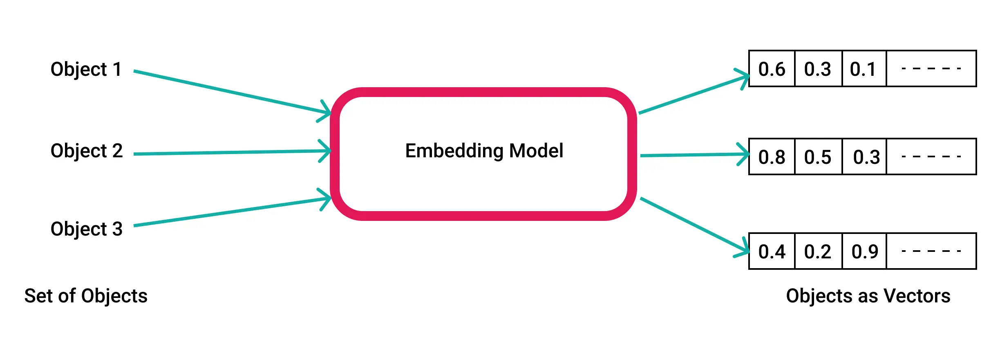

# Traditional Search:

Try to find the most relevant documents to a query. The most common approach is to use a search engine like Google, Bing, or DuckDuckGo. These search engines use a combination of techniques to find the most relevant documents to a query. These techniques include:

# Semantic Search:

a data searching technique that focuses on understanding the contextual meaning and intent behind a user's search query, rather than only matching keywords.

# Faceted Search:

Faceted search is a method of searching through data by using facets, I.e. attributes in the data, to gradually filter down a large selection of data to a smaller one that we are looking for

# Document QA:

Document QA is a task where a model is given a question and a document, and the model must find the answer to the question within the document. This is a challenging task because the model must understand the context of the document and the question in order to find the answer.

# Hybrid Search:

Hybrid search is a combination of different search techniques to provide more accurate and relevant search results. For example, a hybrid search engine might combine traditional search with semantic search to provide more relevant results.

# Embeddings and Vectors

Embeddings and vectors are mathematical representations of words or documents that capture the meaning and context of the words or documents. These embeddings can be used to compare the similarity between words or documents, which can be useful for search tasks.

# Similarity Search

Similarity search is a search technique that finds similar items to a query item based on some similarity metric. For example, in a document search, similarity search might find documents that are similar to a query document based on the content of the documents.

semantic search is about meaning, while similarity search is about finding closely related items.

examples:

- Traditional Search: Google search
- Semantic Search: Google search
- Faceted Search: Amazon search
- Document QA: OpenAI's GPT-3
- Hybrid Search: Bing search
- Embeddings and Vectors: Word2Vec, Doc2Vec
- Similarity Search: Spotify's music recommendation system

# How LLMs Encode Words as High-Dimensional Vectors

When we talk about "high-dimensional vectors," we're referring to long lists of numbers. Instead of representing a word with just 3 or 4 numbers, we might use hundreds or even thousands.

# How embeddings and vectors are used in semantic search

LLMs, such as GPT, don’t randomly generate numbers for words. Instead, they learn patterns from large amounts of text to understand how words are used in different contexts. Words that tend to appear in similar contexts are represented by closely related numerical values. For instance, "dad" and "mum" would have more similar numerical representations than "dad" and "car."

we can do math with vectors, how close animal vectors are to film vectors, closer in graph the closer they are in semantic meaning

### you need a database that supports vectors

Does this database support vectors?
[NeonDB,](https://python.langchain.com/docs/integrations/vectorstores/) as well as [Faiss](<(https://python.langchain.com/docs/integrations/vectorstores/)>) and [Annoy](https://python.langchain.com/docs/integrations/vectorstores/), are some of the databases that support vector storage.

### How embeddings and vectors are used in semantic search

- Take the thing you wanna to be index
- convert it to embedding and vectors
- put them in a vector database (can store array of numbers)
- when query comes in, convert query to vector and compare it with the vectors in the database

### `convertCosmeticsToVectors`:

This function takes a list of cosmetics data and converts it into vector-embedded documents. It uses OpenAI's GPT-3 model to generate embeddings for each cosmetic.

### `createStore`:

This function creates a vector store in memory to store the vector-embedded documents. It needs database that supports vector storage.

### `searchCosmetics`:

This function searches for similar cosmetics based on a given text query. It converts the query into a vector and compares it with the vectors in the store to find the most relevant cosmetics.
